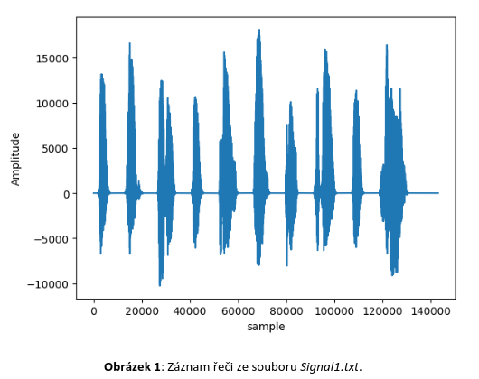
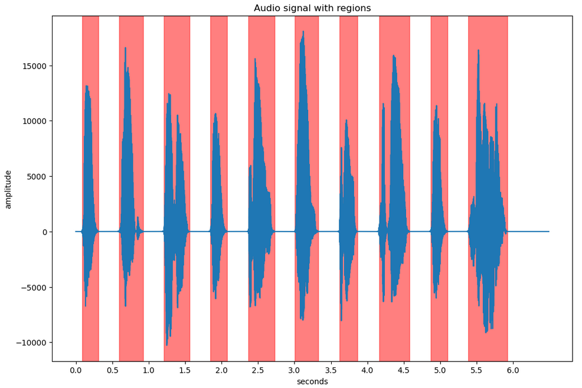
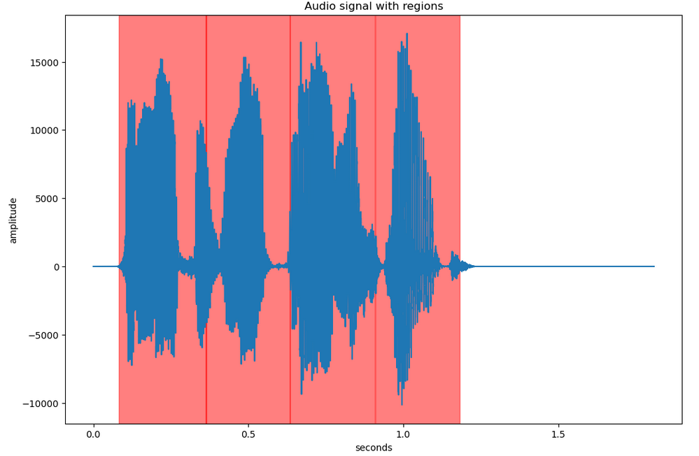
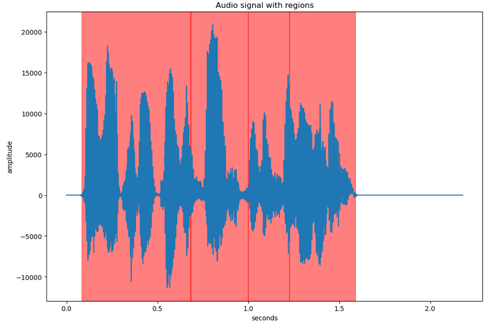

# Semestrální práce KI/PZS - detekce a přiřazení slov v záznamu řeči

Datum: 14.2.2023

Kolaborace: Jakub Kopecký


### Zadání

Ve zdrojovém souboru Signal1.txt a na Obrázku 1 najdete záznam řeči převedený na signál,
resp. časovou řadu. Pomocí metod analýzy signálu v časové oblasti, frekvenční oblasti nebo
jejich kombinací identifikujte jednotlivá slova v záznamu. Vybírejte z následujícího seznamu
slov.
time, prepare, solution, make, mistake, no, the, probable, long, lecture, method, disaster, fail,
work, advice, idea, succeed, easy, is, for, give.
Vámi navržený algoritmus vyzkoušejte na záznamech Signal2.txt a Signal3.txt a identifikujte
slova i v těchto dvou časových řadách. V případě potřeby algoritmus dále vylepšete. Kromě
metod probraných při hodinách lze pro identifikaci jednotlivých slov využít například některé
další funkce, například Hammingova funkce nebo Hilbertova transformace, případně jakoukoli
další metodu, kterou uznáte za vhodnou, vyjma metod založených na strojovém učení.
Vzorkovací frekvence signálu je ve všech případech 22050 Hz. \


### Postup řešení

Nejdříve se odsekne prázdný začátek a konec záznamu řeči a poté se algoritmem za použití prahové hodnoty pro pauzu rozděli záznam na jednotlivá slova. Výstupem jsou tedy části záznamu s ideálně jedním slovem a absolutní regiony pro označení v původním záznamu. Poté se porovnává daná část záznamu s databází možných slov, kde se detekuje similarita jejich vlastností. Similarita se porovnává podle MFCC (Mel-frekvenční kepstrální koeficienty) a také z menší části centroidů, průměrných hodnot, spektra. Podle podobnosti se vytvoří seznam potenciálních slov a vybere se slovo s nejmenším rozdílem.

```
...

# Mel spectrum
sX = librosa.feature.melspectrogram(y=pX, sr=sr, n_fft=2048)
# Mel cepstrum coefs
mfccsX = librosa.feature.mfcc(S=librosa.power_to_db(sX))

...

# Spectral centroid
scX = librosa.feature.spectral_centroid(y=pX, n_fft=2048)

...

similarity = dist_mfccs + dist_sc * 0.25

...
```

Pro detekci slov v řeči není možné použít metodu rozsekávání na slova, jelikož mezi slovy nemusí být dostatečně dlouhá nebo zřetelná pauza. Zde jsem použil metodu okénkového porovnávání, kde se celý záznam rozdělí na části podle velikosti testovaného slova z databáze slov bez ohledu na pozici řečeného slova v záznamu, porovná se similarita a vytvoří seznam potenciálních slov s pozicí v záznamu podle prahové hodnoty.


### Výsledky

Audio signál Signal1.txt s vyznačením výskytu slov v záznamu: \


Detekovaná slova pro vyznačené regiony v signálu Signal1.txt v pořadí podle vyznačení v grafu (nejdříve správné slovo a poté seznam potenciálních slov):
```
the ('the', 849.18) ('long', 1259.56) ('no', 1286.97)
work ('work', 934.09) ('make', 1097.47) ('long', 1643.03)
easy ('easy', 969.31) ('long', 1188.79) ('no', 1379.76)
the ('the', 1213.8) ('long', 1218.95) ('no', 1239.23)
time ('for', 800.51) ('fail', 816.83) ('time', 865.69)
long ('long', 961.67) ('no', 1063.27) ('the', 1615.73)
to ('to', 1049.84) ('the', 1171.34) ('for', 1220.0)
prepare ('probable', 968.79) ('prepare', 1093.65) ('long', 1430.63)
the ('the', 1218.15) ('no', 1225.33) ('long', 1258.34)
solution ('solution', 1762.02) ('disaster', 2606.38) ('probable', 2692.28)
Correct: 8/10 (80.0%)
```

Testování algoritmu na signálu Signal2.txt s vyznačením detekovaných slov:\


Detekovaná slova pro vyznačené regiony v signálu Signal2.txt v pořadí podle vyznačení v grafu:
```
('no', 890.51) ('long', 916.48) ('work', 1288.38)
('work', 1019.4) ('no', 1080.22) ('make', 1138.67)
('make', 1513.01) ('work', 1536.62) ('give', 2257.57)
('for', 1434.6) ('time', 1563.91) ('fail', 1606.92)
```

Testování algoritmu na signálu Signal3.txt s vyznačením detekovaných slov:\


Detekovaná slova pro vyznačené regiony v signálu Signal3.txt v pořadí podle vyznačení v grafu:
```
('probable', 2502.2) ('lecture', 2810.97) ('prepare', 2842.08)
('make', 1387.42) ('work', 1432.37) ('lecture', 1812.23)
('easy', 1388.07) ('the', 1658.5) ('give', 1816.42)
('easy', 1330.91) ('idea', 1590.2) ('long', 1593.63)
```

### Závěr

Prvotní detekce slov v záznamu s pauzou funguje vcelku dobře, až na nějáké nedostatky, a postup pro získání a porovnání vlastností slov je dostačující pro, v dost případech, správnou detekci. Algoritmus bohužel, i dle očekávání, selhává v detekci slov v řečí bez pauz, kde detekuje slova, které na místě nejsou, i menší části slov jako slovo jednotné. Většina dnešních algoritmů pro detekci slov v lidské řeči jsou založené na metodách strojového učení a možná k tomu bude nějáký důvod, možná jsou tyto klasické metody už nedostačující.

**Zdroje a použitá literatura:** \
- [Librosa dokumentace](https://librosa.org/doc/latest/index.html) \
- [Understanding the Mel Spectrogram (Leland Roberts)](https://medium.com/analytics-vidhya/understanding-the-mel-spectrogram-fca2afa2ce53) \
- [Speech Recognition — Feature Extraction MFCC & PLP (Jonathan Hui)](https://jonathan-hui.medium.com/speech-recognition-feature-extraction-mfcc-plp-5455f5a69dd9) \